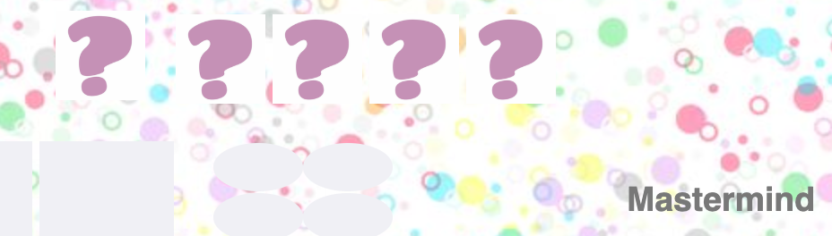

# SEI Project 1 - Mastermind
See the game online at: https://leealex88.github.io/sei-project-1/


### Timeframe & Team
- 7 days, solo

### Technologies
 - HTML5
 - CSS3
 - JavaScript
 - Animate.css
 - SCSS
 - Flexbox
 - Git
 - GitHub

### Getting Started

Use the clone button to download the game source code. Open the index.html file in your browser and the game should start, if not check console for any issues.

## Logic

 At the beginning of each game the computer generates a secret code of four colors. The colors are always chosen from the same six colors, no duplicates allowed.



 Your objective is to guess the secret code. You will have to guess the colors and put them in the same order as they are in the secret code.

 Choose four colors in the next available row. The computer will score your guess in the following way:

 For each guess that is right in both color and position you get a black point

 For each guess that is right in color but not in position you get a red point

After completing each row, user guess will be checked by function 'checkLine'
and will display the result message: 'Try again!', 'You won!'.

```js
let result = []
function checkLine() {
  for (let i = 0; i < 4; i++) {
    // console.log('loop start')
    const pChoice = playerChoice[i]
    // Correct colour, correct position
    if (pChoice === computerChoice[i]) {
      hintSquares[hintIndex].classList.add('blackHint')
      result.push('blackHint')
      changeHintIndex()
    } else {
      for (let j = 0; j < 4; j++){
        if(j === i){
          continue
        }
        console.log({i, j})
        if (pChoice === computerChoice[j]){
          hintSquares[hintIndex].classList.add('redHint')
          result.push('redHint')
          changeHintIndex()
        }
      }
    }
    // else if Colour exists in computerChoice array
    // console.log('loop end')
  }
  console.log('result is', result)
}
function resultMessage() {
  if (result.length < 4 || result.includes('redHint')) {
    setTimeout(() => {
      window.alert('Try again!')
    }, 500)
  } else if (result.every(hint => hint === 'blackHint')) {
    setTimeout(() => {
      window.alert('You won!')
    }, 500)
  }

}
```

On the left side you can see two buttons: 'Reset' if you want to start the Game from the beginning and 'Check it' if you want to check the solution before finishing the game.

## Challenges and future improvements

The first challenge I encountered was to create the function which is going to check the line with the colors chosen by the user and will add the hint colors in the grit next to it.

Please see below:

```js
let result = []
function checkLine() {
  for (let i = 0; i < 4; i++) {
    // console.log('loop start')
    const pChoice = playerChoice[i]
    // Correct colour, correct position
    if (pChoice === computerChoice[i]) {
      hintSquares[hintIndex].classList.add('blackHint')
      result.push('blackHint')
      changeHintIndex()
    } else {
      for (let j = 0; j < 4; j++){
        if(j === i){
          continue
        }
        console.log({i, j})
        if (pChoice === computerChoice[j]){
          hintSquares[hintIndex].classList.add('redHint')
          result.push('redHint')
          changeHintIndex()
        }
      }
    }
```
## Wins

My first experience with JavaScript was the morning lecture in GA and then creating this game. I'm very happy with the knowledge I master and this that I was able to create not just the vanilla JavaScript code but also the logic.   

## Future features
In terms of future improvements, I would like to add the function to reset the game after the user guessed the secret colors code and the different option of the code length to choose, 6 and 8, and let the user to decide or he want to allow duplicates colors or not.

## Key Learnings

- 'For Loop'
- 'If else statment'
- adding grid in JS
- manipulate DOM elements

## Author

Ola Skoczylas - First Project Link to portfolio here: olaskoczylas.com
